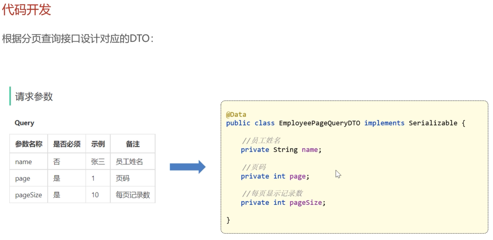
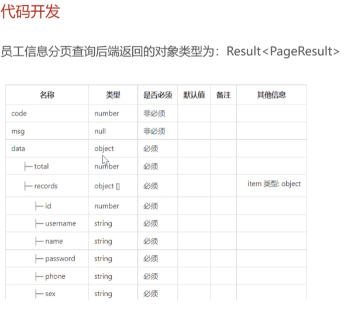

# 员工分页查询 — *Employee Pagination Query*

> 后台管理端的列表页都需要分页：每页显示 N 条，可以翻页、按条件过滤。我们用 **PageHelper** 插件 + 一对统一的 DTO/VO 结构（`PageQueryDTO` → `PageResult`），所有列表接口都按这个套路写。
>
> *Every admin-side list page needs pagination: N rows per page, with paging and filtering. We use the **PageHelper** plugin plus a unified DTO/VO pair (`PageQueryDTO` → `PageResult`) — every list endpoint follows the same recipe.*

## 产品经理 UI — *Product Manager's UI*


## 需求实现 — *Requirements Implementation*


## 代码实现 — *Code Implementation*


## 以后所有分页查询的统一规定 — *Unified Convention for All Future Paginated Queries*




---

## 调用流程 — *Call Flow*

```text
前端发起请求：GET /admin/employee/page?page=1&pageSize=10&name=张
                  ↓
EmployeeController.page(EmployeePageQueryDTO dto)
                  ↓
EmployeeService.pageQuery(dto)
                  ↓
PageHelper.startPage(dto.getPage(), dto.getPageSize());  ← 必须紧贴下面的查询！
                  ↓
Page<Employee> page = employeeMapper.pageQuery(dto);     ← MyBatis 自动加 LIMIT
                  ↓
return new PageResult(page.getTotal(), page.getResult());
                  ↓
Result.success(pageResult)
```

*Frontend → `GET /admin/employee/page?page=1&pageSize=10&name=张` → `EmployeeController.page(dto)` → `EmployeeService.pageQuery(dto)` → `PageHelper.startPage(page, pageSize)` (**must immediately precede the query**) → `employeeMapper.pageQuery(dto)` (MyBatis automatically appends `LIMIT`) → wrap into `PageResult(total, records)` → `Result.success(pageResult)`.*

## 关键约定 — *Key Conventions*

| 约定 / Convention | 说明 / Description |
| --- | --- |
| 输入用 `XxxPageQueryDTO` | 包含 `page`、`pageSize` + 各种查询条件 / *Holds `page`, `pageSize`, and any filter fields.* |
| 输出用 `PageResult` | 包含 `total`（总条数）+ `records`（当前页的列表）/ *Holds `total` and `records` for the current page.* |
| `PageHelper.startPage(...)` | 必须**紧贴**下一句查询，中间隔了别的代码就失效 / *Must come **immediately** before the next query — any intervening code breaks it.* |
| Mapper 返回类型 | `Page<Xxx>`（继承自 `ArrayList`，自带 `getTotal()` / `getResult()`）/ *`Page<Xxx>` (extends `ArrayList`, has `getTotal()` / `getResult()` built in).* |
