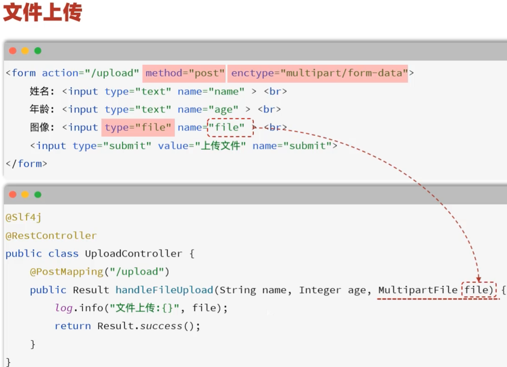

# 上传文件 — *File Upload*

> 新增菜品时，前端会先调用文件上传接口，把图片送到对象存储（OSS / S3 / 本地），后端返回可访问的 URL。这个 URL 之后会随 `DishDTO` 一起再发回来保存到 `dish.image` 字段。
>
> *Before adding a dish, the front end first calls the file-upload endpoint to push the image to an object store (Aliyun OSS / AWS S3 / local disk); the backend returns a publicly accessible URL. That URL is later sent back with the `DishDTO` and persisted into the `dish.image` column.*



## 1. 接口定义 — *Endpoint Definition*

| 项 / Item | 值 / Value |
| --- | --- |
| 路径 / Path | `/admin/common/upload` |
| 方式 / Method | `POST` |
| 请求参数 / Parameter | `MultipartFile file`（表单提交 / form upload） |
| 返回 / Response | `Result<String>`（`data` 是图片 URL / `data` is the image URL） |

## 2. 调用流程 — *Call Flow*

```text
前端选图片
   ↓
POST /admin/common/upload  (multipart/form-data)
   ↓
CommonController.upload(MultipartFile file)
   ↓
调对象存储工具：aliOssUtil.upload(...)  /  awsS3Util.upload(...)
   ↓
对象存储返回可访问 URL
   ↓
Result.success(url)  ← 返回给前端
```

*Frontend picks an image → `POST /admin/common/upload` (multipart/form-data) → `CommonController.upload(MultipartFile file)` → call the object-storage util (`aliOssUtil.upload(...)` or `awsS3Util.upload(...)`) → the store returns a public URL → `Result.success(url)` is sent back to the frontend.*

## 3. 注意点 — *Things to Watch Out For*

- **AccessKey 不能 commit 到 Git**：放在 `application.yml` 里，并把它加进 `.gitignore`，或者用环境变量
- **Bucket 权限**：设成"公共读"，否则前端拿不到图片
- **文件大小限制**：在 `application.yml` 配 `spring.servlet.multipart.max-file-size` / `max-request-size`
- **文件名冲突**：用 UUID 重命名上传文件，避免覆盖

***Key points:***

- ***Never commit AccessKeys to Git** — keep them in `application.yml` (with that file added to `.gitignore`) or read them from environment variables.*
- ***Bucket permissions** — set to "public read", otherwise the frontend cannot fetch the uploaded image.*
- ***File size limits** — configure `spring.servlet.multipart.max-file-size` and `max-request-size` in `application.yml`.*
- ***Filename collisions** — rename uploaded files with a UUID so newer uploads do not overwrite older ones.*
