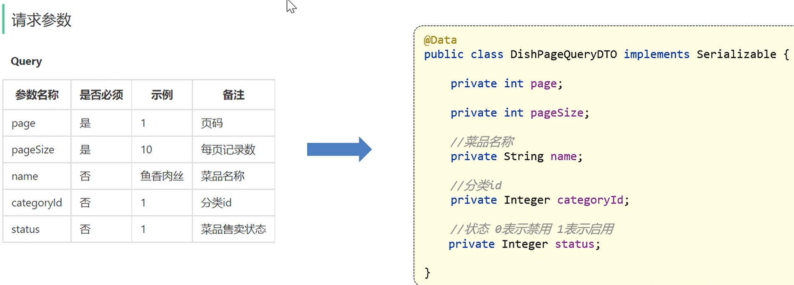

# 分页查询菜品 — *Dish Pagination Query*

## 这里的 categoryName 是原本没有的，要用 id 查询 — *`categoryName` Is Not a Native Column — It Must Be Joined from `category_id`*

`dish` 表只有 `category_id`（外键 id），没有 `categoryName`（分类名）。前端要展示"宫保鸡丁 - 川菜"这种带分类名的列表，必须 **LEFT JOIN `category` 表**把名字关联出来。

*The `dish` table only stores `category_id` (a foreign-key ID), not `categoryName`. To display rows like "Kung Pao Chicken — Sichuan Cuisine" on the front end, we must **LEFT JOIN the `category` table** to fetch the human-readable name.*

```sql
select d.*, c.name as categoryName
from dish d
left outer join category c on d.category_id = c.id
```

`d.*` 取菜品所有字段，`c.name as categoryName` **额外**取出分类名并起别名 `categoryName`——这就是 `DishVO` 比 `Dish` 实体多出来的那个字段。

*`d.*` selects every column from the dish table; `c.name as categoryName` **additionally** retrieves the category name aliased as `categoryName` — this is exactly the extra field `DishVO` has on top of the `Dish` entity.*



## 接口示意 — *Endpoint Diagram*


## 关键代码片段 — *Key Code Snippets*

### Mapper XML（`DishMapper.xml`）

```xml
<select id="pageQuery" resultType="com.sky.vo.DishVO">
    select d.*, c.name as categoryName
    from dish d
    left outer join category c on d.category_id = c.id
    <where>
        <if test="name != null">
            and d.name like concat('%', #{name}, '%')
        </if>
        <if test="categoryId != null">
            and d.category_id = #{categoryId}
        </if>
        <if test="status != null">
            and d.status = #{status}
        </if>
    </where>
</select>
```

### Service 实现（`DishServicempl.java`）

```java
public PageResult pageQuery(DishPageQueryDTO dishPageQueryDTO) {
    PageHelper.startPage(dishPageQueryDTO.getPage(), dishPageQueryDTO.getPageSize());
    Page<DishVO> page = dishMapper.pageQuery(dishPageQueryDTO);
    return new PageResult(page.getTotal(), page.getResult());
}
```

## 几个细节 — *A Few Details Worth Noting*

- **`<where>` 标签**：自动去掉第一个条件前多余的 `and`，省得手动判断 — *the `<where>` tag automatically strips the leading `and` from the first condition, so you don't have to.*
- **`PageHelper.startPage(...)`**：必须在**紧挨着的下一个查询**之前调用，否则分页不生效 — *must be called **immediately before** the next query; otherwise pagination will not take effect.*
- **`resultType="com.sky.vo.DishVO"`**：用全限定类名让 MyBatis 自动把每行 → DishVO 对象 — *use the fully-qualified class name so MyBatis maps each row directly into a `DishVO` instance.*
- **列表页通常不查 flavors**：节省性能，详情页才查 — *list pages usually skip the `flavors` join for performance; only the detail page loads them.*
