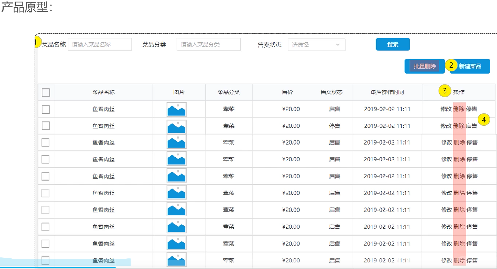
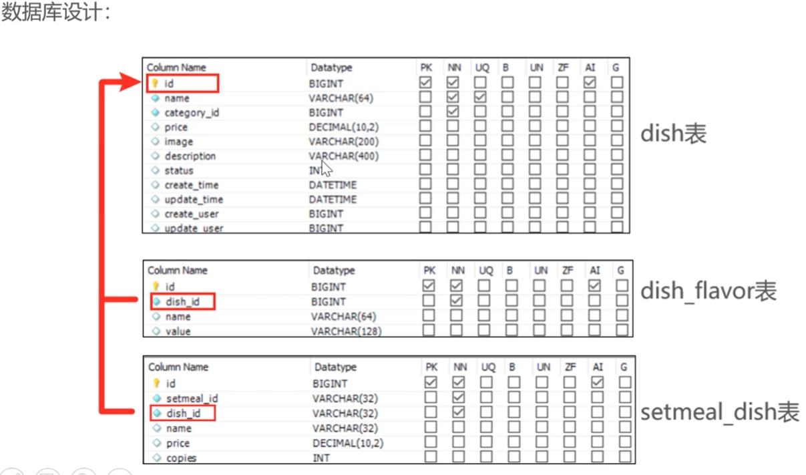
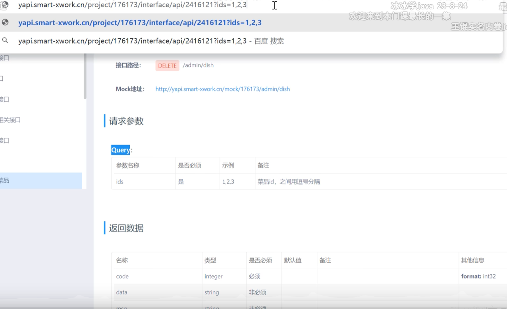

# 新增菜品 — 需求分析与设计 — *Add Dish: Requirements Analysis & Design*

> 本篇是 **Day03-05 — 新增菜品_需求分析和设计** 的文字版整理，包含**业务规则**、**接口设计**（请求参数与返回结果）以及**数据库设计**，方便直接复制对照。
>
> *This note is the text-form summary of **Day03-05 — Add Dish: Requirements & Design**. It covers **business rules**, **API design** (request parameters and responses), and the **database design**, so you can copy and cross-check directly.*



---

## 1. 业务规则 — *Business Rules*

- **菜品名称必须是唯一的**
- **菜品必须属于某个分类下，不能单独存在**
- **新增菜品时可以根据情况选择菜品的口味属性**
- **每个菜品必须对应一张图片**

***Key rules:***

- ***Dish names must be unique.***
- ***A dish must belong to a category — it cannot exist on its own.***
- ***When adding a dish, you may optionally configure flavor attributes.***
- ***Every dish must have an image.***

---

## 2. 接口设计 — *API Design*

### 2.1 根据类型查询分类（已实现） — *Query Categories by Type (Already Implemented)*

由于新增菜品时必须选择所属分类，所以前端页面一打开，就会发送一个异步请求，查询出所有**菜品分类**（`type = 1`），并在下拉列表中回显。

*Because adding a dish requires choosing a category, the front end fires an async request as soon as the page opens to fetch all **dish categories** (`type = 1`) and populate the dropdown.*

- **请求路径 / Path：** `/admin/category/list`
- **请求方式 / Method：** `GET`
- **请求参数 / Parameter：** `type=1`

### 2.2 文件上传（重要前置接口） — *File Upload (Critical Prerequisite Endpoint)*

新增菜品必须上传图片。前端点击上传图片时，会触发该接口，后端将图片存入 OSS（或本地）后，**必须返回图片的可访问 URL 地址**。

*Adding a dish requires uploading an image. When the user picks a file on the front end, this endpoint is triggered; the backend stores the image into OSS (or local disk) and **must return a publicly accessible URL**.*

- **请求路径 / Path：** `/admin/common/upload`
- **请求方式 / Method：** `POST`
- **请求参数 / Parameter：** `MultipartFile file`（表单提交 / form upload）
- **返回数据 / Response：** `Result<String>` （`data` 为图片的 URL 地址 / `data` is the image URL）

### 2.3 新增菜品（核心接口） — *Add Dish (Core Endpoint)*

- **请求路径 / Path：** `/admin/dish`
- **请求方式 / Method：** `POST`
- **请求参数 / Parameter：** JSON 格式（对应后端 `DishDTO`） / JSON body (mapped to backend `DishDTO`)

#### 📥 请求参数（DishDTO 属性明细） — *Request Body (`DishDTO` Field Breakdown)*

```json
{
  "name": "下饭酸菜鱼",      // 菜品名称 (String)
  "categoryId": 10,        // 分类ID (Long)
  "price": 38.00,          // 菜品价格 (BigDecimal)
  "image": "http://...",   // 菜品图片路径 (String)
  "description": "酸辣爽口", // 描述信息 (String)
  "status": 1,             // 状态: 0 停售, 1 起售 (Integer)
  "flavors": [             // 菜品口味关系列表 (List)
    {
      "name": "辣度",
      "value": "[\"微辣\",\"中辣\",\"特辣\"]"
    },
    {
      "name": "忌口",
      "value": "[\"不要葱\",\"不要蒜\"]"
    }
  ]
}
```

- **返回数据 / Response：** `Result`（成功或失败提示，无需携带 data / success/failure indicator, no `data` payload）

---

## 3. 数据库设计（涉及两张表） — *Database Design (Two Tables Involved)*

新增菜品是一个**多表操作**。前端只发送了一次页面提交，但后端需要同时向以下两张表插入数据：

*Adding a dish is a **multi-table operation**. The front end submits the form just once, but the backend must insert into both of the tables below:*

### 3.1 菜品表 (`dish`) — 主表 — *`dish` table — primary table*

一条基本信息对应表里的一行数据：

*Each dish's basic info maps to a single row in this table:*

- `id` (主键 / primary key)
- `name` (菜品名称 / dish name)
- `category_id` (分类 ID / category ID)
- `price` (价格 / price)
- `image` (图片地址 / image URL)
- `description` (描述 / description)
- `status` (状态 / status)
- `create_time` / `update_time` / `create_user` / `update_user` (公共字段，已用 AOP 自动填充 / common audit fields, auto-filled by AOP)

### 3.2 菜品口味表 (`dish_flavor`) — 从表（一对多） — *`dish_flavor` table — child table (one-to-many)*

一个菜品可以有多个口味（如既有"辣度"又有"冰量"），所以需要多条数据记录：

*One dish can have multiple flavors (e.g. both a "spice level" and an "ice level"), so multiple rows are needed:*

- `id` (主键 / primary key)
- `dish_id` (**核心外键**：关联 `dish` 表的 `id` / **the critical foreign key**: references `dish.id`)
- `name` (口味名称，如：辣度 / flavor name, e.g. "Spice Level")
- `value` (口味列表，如：`["微辣","中辣"]` / list of options, e.g. `["mild","medium"]`)

---

### 💡 后端开发避坑提示 — *Backend Implementation Pitfalls*

1. **统一 DTO 接收数据**：Controller 层需要用 `@RequestBody DishDTO dishDTO` 来接收前端的 JSON 数据。
2. **主键回显（核心扣分点）**：在往 `dish` 表插入菜品后，必须通过 MyBatis 的 `useGeneratedKeys="true" keyProperty="id"` **拿到刚刚生成的菜品 ID**。因为紧接着往 `dish_flavor` 表插入具体口味时，每一条记录都需要绑定这个 `dish_id`！

***Key gotchas:***

1. ***Use a unified DTO to receive data** — the Controller should declare `@RequestBody DishDTO dishDTO` to bind the incoming JSON.*
2. ***Primary-key write-back (the most-missed point)** — after inserting into the `dish` table, you must use MyBatis's `useGeneratedKeys="true" keyProperty="id"` to **capture the newly generated dish ID**. The follow-up inserts into `dish_flavor` must bind every row to this `dish_id`!*


# 数据库设计 — *Database Design*



# 看一下接口 — *Inspect the Endpoint*



## 是按 query 来看的，各个 id 之间用逗号来间隔 — *Parameters Are Passed as a Query String; Multiple IDs Are Separated by Commas*
