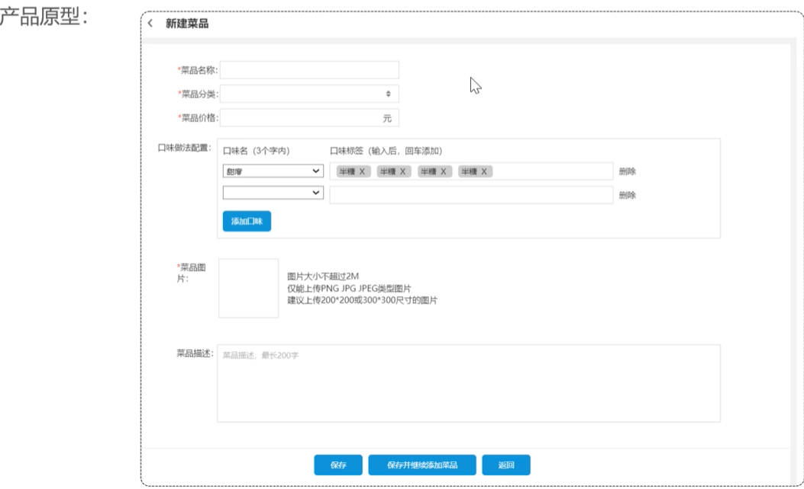
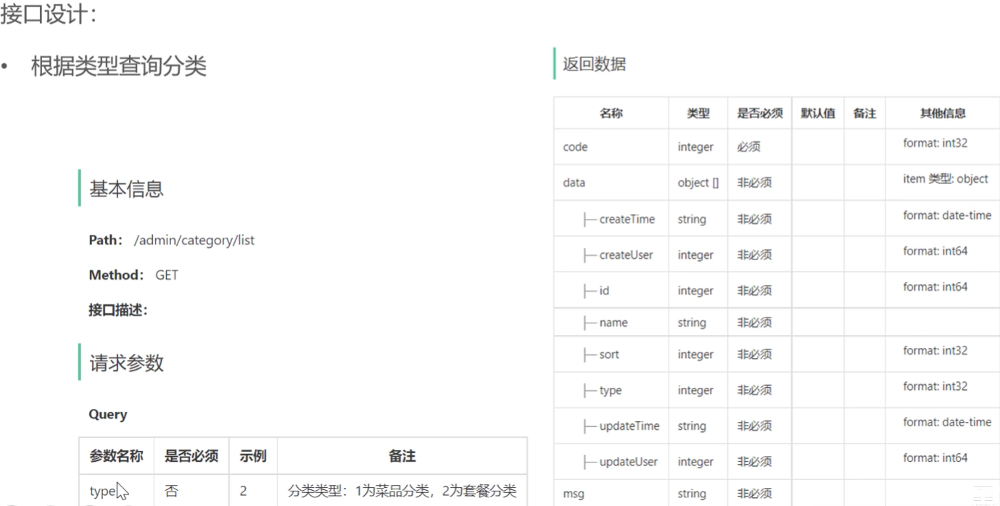

# 新增菜品截图速览 — *Add Dish: Quick Visual Reference*

> 这是"新增菜品"功能的视觉速查版（截图为主）。文字详解版见 `017 - day3 新增菜品需求分析与设计`。
>
> *Screenshot-based quick reference for the "Add Dish" feature. For the detailed text version, see `017 - day3 Add Dish Requirements & Design`.*

## 业务规则 — *Business Rules*

- 菜品名称必须是唯一的
- 菜品必须属于某个分类下，不能单独存在
- 新增菜品时可以根据情况选择菜品的[配置/属性]（注：视频右侧被遮挡，这里通常指口味或规格）
- 每个菜品必须对应一张图片

***Key rules:***

- *Dish names must be unique.*
- *Every dish must belong to a category — it cannot exist on its own.*
- *When adding a dish, you may optionally configure its attributes (note: the right side of the video was clipped; this usually means flavors or specifications).*
- *Each dish must have a corresponding image.*

## 接口 1 — *Endpoint 1*

## 接口 2 — *Endpoint 2*

## 接口 3 — *Endpoint 3*

## 数据库设计 — *Database Design*

