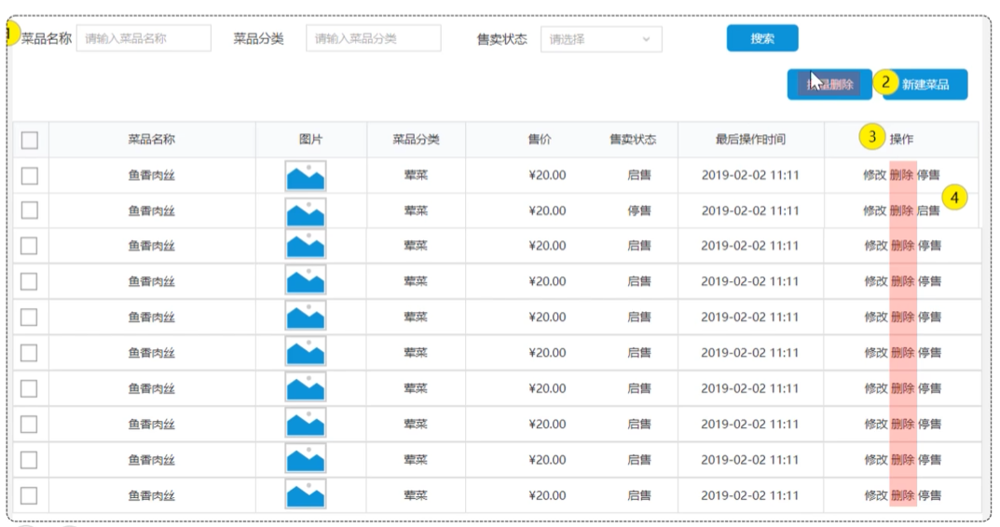
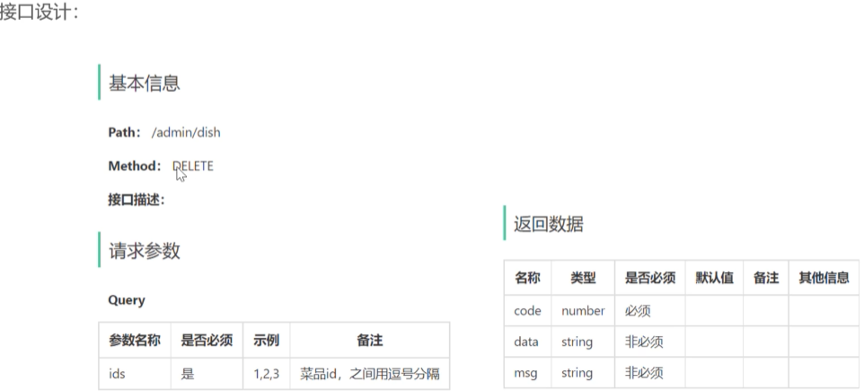
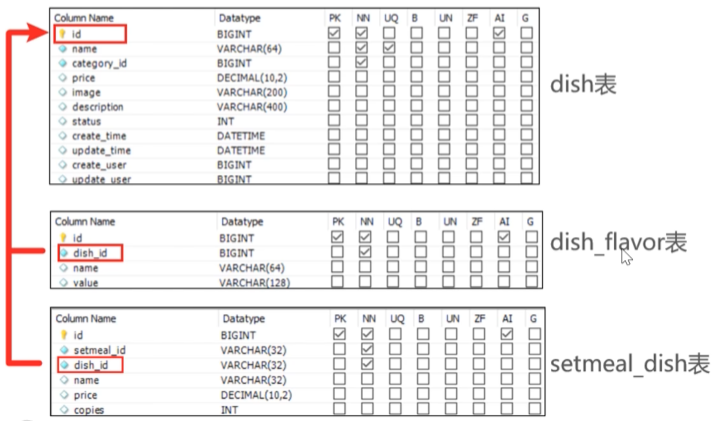

# 删除菜品 — *Delete Dish*

## 原型 — *Prototype*


## 业务规则 — *Business Rules*

删除菜品的业务规则主要包括以下四条：

*The deletion rules for a dish consist of the following four constraints:*

1. **可以一次删除一个菜品，也可以批量删除菜品** —— 接口要同时支持单删和批删
2. **起售中（status = 1）的菜品不能删除** —— 必须先停售才能删
3. **被套餐关联的菜品不能删除** —— 否则套餐里会出现"幽灵菜品"
4. **删除菜品后，关联的口味数据也需要删除掉** —— `dish_flavor` 表的对应行也要一起清掉，否则成为孤儿数据

***Rules in detail:***

1. ***Both single delete and batch delete must be supported** — the endpoint accepts one or more dish IDs.*
2. ***Dishes currently on sale (`status = 1`) cannot be deleted** — they must first be taken off-sale.*
3. ***Dishes referenced by a setmeal cannot be deleted** — otherwise the setmeal would point to "ghost dishes".*
4. ***When a dish is deleted, its associated flavors must be deleted as well** — the corresponding rows in `dish_flavor` must be cleaned up, or they become orphan records.*

## 接口 — *Endpoint*


## 数据库关系 — *Database Relationships*


---

## 实现要点 — *Implementation Highlights*

```text
DELETE /admin/dish?ids=1,2,3
       ↓
DishController.delete(@RequestParam List<Long> ids)
       ↓
DishService.deleteBatch(ids)
       ├── ① 检查每个 dish 的 status —— 起售中则抛业务异常
       │   if (status == 1) throw new DeletionNotAllowedException(...)
       ├── ② 检查是否被套餐关联 —— 在 setmeal_dish 表里查
       │   if (setmealDishMapper.countByDishIds(ids) > 0) throw ...
       ├── ③ 删除 dish 表里的多条记录
       │   dishMapper.deleteBatch(ids)
       └── ④ 删除 dish_flavor 里关联的口味
           dishFlavorMapper.deleteByDishIds(ids)
       ↓
Result.success()
```

*`DELETE /admin/dish?ids=1,2,3` → `DishController.delete(ids)` → `DishService.deleteBatch(ids)`: ① check each dish's status — throw `DeletionNotAllowedException` if any is on sale; ② check whether any of the dishes is referenced by a setmeal (query `setmeal_dish`) — throw if so; ③ batch-delete rows in `dish`; ④ cascade-delete rows in `dish_flavor` by `dish_id` — finally `Result.success()`.*

## 几个细节 — *A Few Details*

- **`@RequestParam List<Long> ids`**：前端用 `?ids=1,2,3` 传，Spring 自动按逗号拆成 List / *Frontend passes `?ids=1,2,3`; Spring auto-splits by comma into a `List<Long>`.*
- **业务校验顺序**：先校验"能不能删"，再真删 —— 避免删一半被异常打断造成脏数据 / *Validate first, mutate second — otherwise a half-completed delete could be interrupted by an exception and leave the DB inconsistent.*
- **理想情况下放进同一个事务**：在 Service 方法上加 `@Transactional`，4 步要么全成功要么全回滚 / *Wrap the 4 steps in a `@Transactional` Service method — all-or-nothing semantics.*
- **MyBatis 批量删除**：用 `<foreach>` 拼 `IN (?, ?, ?)`，不要循环单条执行 / *Use a MyBatis `<foreach>` to build `IN (?, ?, ?)` — never loop and execute one delete per ID.*
