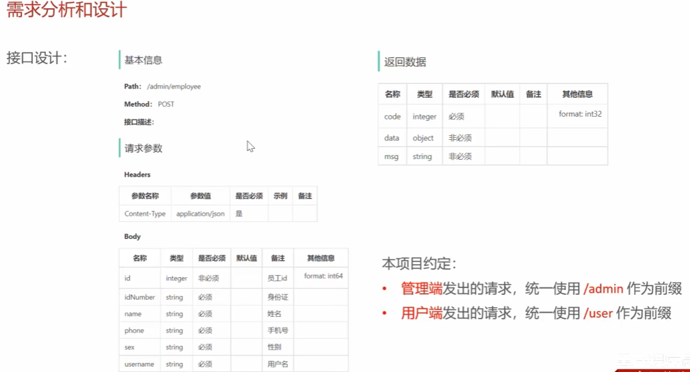
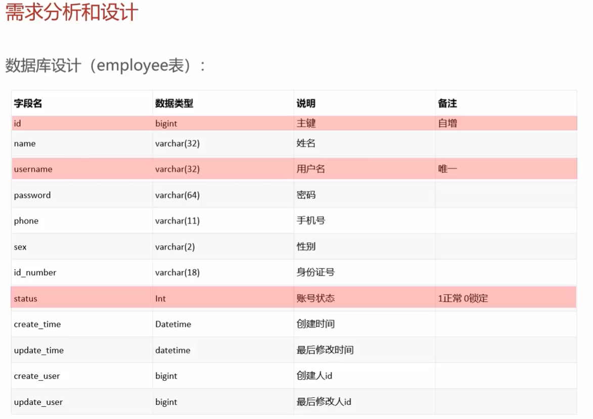
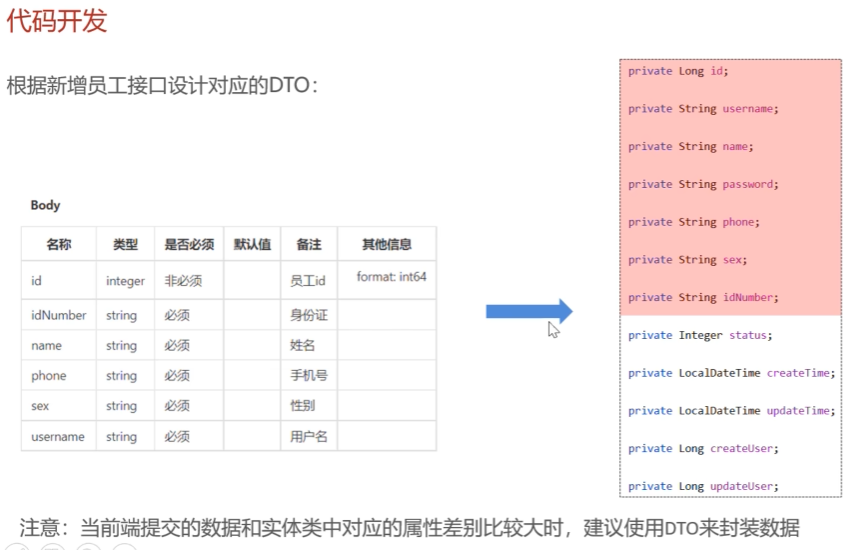

# 数据库结构

#为什么建议使用 DTO 来封装数据

这是一个非常专业的开发问题。从你正在看的 [Day02-02-新增员工_代码开发](https://www.google.com/search?q=https://www.bilibili.com/video/BV1TP411v7v6%3Fp%3D17) 视频中可以看到，老师专门强调了“建议使用 DTO 来封装数据”。

在 Java 开发中，使用 **DTO**（Data Transfer Object，数据传输对象）来封装前端传来的参数，主要有以下三个核心原因：

---

### 1. 解决“属性不一致”的尴尬

这是最直接的原因。

* **前端传来的数据**：可能只有 `username`、`name`、`idNumber` 等几个字段。
* **数据库实体类 (Entity)**：通常包含很多前端不需要传、甚至**不能**让前端传的字段，比如 `createTime`（创建时间）、`updateUser`（修改人）、`status`（账号状态）。
* **为什么要用 DTO**：如果直接用 Entity 接收，当前端没传 `status` 时，Entity 里的这个字段就是 null。如果你不小心把这个 null 存进数据库，可能就会把原本默认的“启用”状态覆盖成“禁用”。**DTO 就像是一个精简版的“定制小盒子”，只装前端该给的那部分东西。**

---

### 2. 安全隔离：保护你的数据库“隐私”

**Entity（实体类）** 是和数据库表结构一一对应的，它是后端的“底裤”。

* 如果你直接把 Entity 丢给前端或者让前端直接填满 Entity，就相当于把数据库的所有字段暴露给了外部。
* **风险场景**：万一恶意用户在请求里偷偷加了一个字段 `role: "admin"`，而你的代码刚好是直接把接收到的对象存入数据库，那这个用户可能就通过一个简单的“新增员工”接口把自己提拔成了管理员。
* **DTO 的作用**：它充当了**防火墙**。只有在 DTO 里定义的字段，后端才会接收并处理。

---

### 3. 灵活应对多种场景

一个数据库表（Entity）通常只有一套字段，但业务场景是多变的：

* **新增员工**：不需要传 `id`（数据库自增）。
* **修改员工**：必须传 `id`（才知道改谁）。
* **查询员工**：可能只需要 `name` 关键字。

如果你只用一个 Entity，它会变得非常臃肿且难以维护。通过定义 `EmployeeDTO`、`EmployeeLoginDTO`、`EmployeePageQueryDTO`，你可以为每个接口**量身定制**参数模型，代码逻辑会清晰得多。

---

### 📝 职业选手的“思维导图”

| 对象类型 | 缩写全称 | 职责范围 |
| --- | --- | --- |
| **DTO** | Data Transfer Object | **进站口**：负责接收前端传来的数据，或者给前端返回特定数据。 |
| **Entity** | Entity / PO | **家门口**：负责和数据库打交道，字段必须和表结构一致。 |
| **VO** | View Object | **展示柜**：专门给前端展示用的对象（比如脱敏后的手机号）。 |

---

### 💡 视频里的具体体现

你可以留意一下视频 05:00 左右，老师在 `EmployeeController` 的 `save` 方法里接收的是 `EmployeeDTO`，但在调用 `employeeService.save(employeeDTO)` 后，在 Service 层内部会通过 `BeanUtils.copyProperties(employeeDTO, employee)` 把 DTO 的值拷贝给 Entity。

**这就是标准的做法：**

1. **Controller 层**：用 **DTO** 接，干净、安全。
2. **Service 层**：把 **DTO 转成 Entity**，进行业务处理和持久化。

你现在的代码里，是不是正在写 `BeanUtils.copyProperties` 这一行？如果这一步漏了，数据库可是存不进数据的哦。