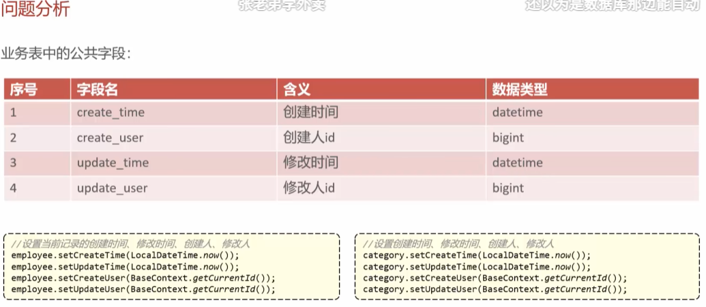
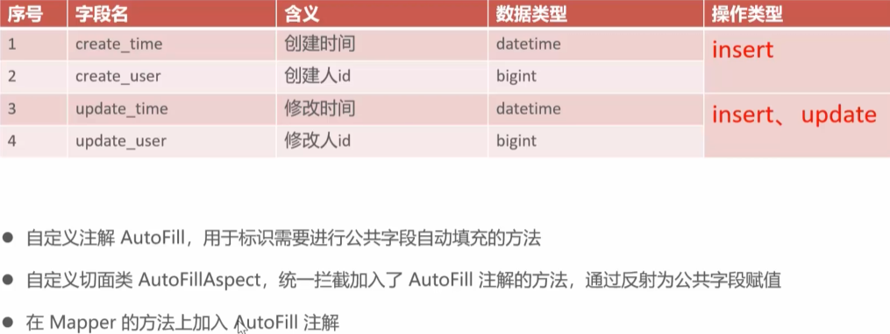

**公共字段自动填充**，简单来说，就是把数据库表里**每个表都有、且每次新增或修改时都需要重复赋值的字段**，交给程序自动去填，不再需要人工手动一条条写 `set` 代码。



---

### 1. 什么是“公共字段”？

在企业级开发中，为了方便后期审计和追溯数据，基本上**每一张数据库表**（比如员工表、分类表、菜品表、套餐表）都会包含以下 4 个字段：

| 字段名 | 含义 | 操作类型 | 填充的值 |
| --- | --- | --- | --- |
| `create_time` | 创建时间 | `INSERT` (新增时) | 当前系统时间 |
| `create_user` | 创建人 ID | `INSERT` (新增时) | 当前登录用户的 ID |
| `update_time` | 修改时间 | `INSERT`、`UPDATE` (新增和修改时) | 当前系统时间 |
| `update_user` | 修改人 ID | `INSERT`、`UPDATE` (新增和修改时) | 当前登录用户的 ID |

这就是所谓的**公共字段**。

---

### 2. 为什么要搞“自动填充”？（痛点）

在没有做自动填充之前（比如 Day02 阶段），你每写一个新增或修改的功能，在 Service 层的实现类（`ServiceImpl`）里都得手动敲上这几行代码：

```java
// 新增员工时要手动写：
employee.setCreateTime(LocalDateTime.now());
employee.setUpdateTime(LocalDateTime.now());
employee.setCreateUser(BaseContext.getCurrentId());
employee.setUpdateUser(BaseContext.getCurrentId());

// 新增分类时又要手动写一遍：
category.setCreateTime(LocalDateTime.now());
category.setUpdateTime(LocalDateTime.now());
// ... 后面还有一堆重复的 set

```

**这样做有什么坏处？**

1. **代码太冗余**：项目里有几十个增删改查，你就要复制粘贴几百行一模一样的 `set` 代码。
2. **极其容易漏写**：万一哪个新手程序员在写“新增菜品”时忘了 `setCreateTime`，数据库直接就会报错或者存入 `null` 值，产生 Bug。

---

### 3. “自动填充”是怎么实现的？

为了解决这个痛点，黑马的老师带大家使用了 **AOP（面向切面编程） + 反射机制**。

它的核心思想是：**“横向切一刀，统一拦截，集中处理”**。

1. **统一拦截**：通过 AOP，让程序死死盯着所有的 `Mapper` 层方法。只要发现某个方法身上贴了特定的标签（比如自定义注解 `@AutoFill`），AOP 就会把这个方法**拦截**下来。
2. **自动塞值（反射）**：拦截下来后，AOP 会自动获取你传进去的实体类对象（比如 `Employee` 或 `Category`），然后利用 **Java 反射机制** 自动去调用它们的 `setCreateTime()`、`setUpdateUser()` 等方法，把时间和当前登录工号强行塞进去。
3. **放行**：塞完值后，再让代码继续往下走，去执行真正的 SQL 语句。

### 最终效果

做完这个功能后，以后你再写任何的 Service 业务代码，**那 4 行枯燥的 `set` 代码一行都不用写了**。

你只需要在对应的 Mapper 接口方法上轻松贴一个注解：

```java
@AutoFill(value = OperationType.INSERT) // 告诉AOP：这是新增操作，帮我自动填4个字段
void insert(Category category);

```

业务代码瞬间变得无比干净、优雅，这就是公共字段自动填充的魅力。

简单来说，**AOP 是一种“编程思想”**，而**切面（Aspect）是这种思想在代码里的“具体实现”**。

我们可以用一句话理清它们的关系：**AOP 是我们要去解决问题的核心思想，而切面就是我们为了实现这个思想而写出来的一个具体的 Java 类。**

为了让你彻底搞懂，我们把这两个概念放在一起拆解：

---

## 1. 什么是 AOP？（大局观）

**AOP（Aspect-Oriented Programming，面向切面编程）** 是一种设计模式和编程思想。

* **它的目标：** 把那些与核心业务无关、却在多个地方重复出现的“大锅饭代码”（如：公共字段填充、日志记录、权限校验、事务管理），从普通的业务方法中**抽离出来，集中管理**。
* **它的手法（横向切一刀）：** 传统的 Java 开发（OOP）是纵向的（Service 调用 Mapper，Mapper 操作数据库）。AOP 则是在这个调用链条中**横向拦截**，在方法执行前或执行后自动插播一段逻辑，从而实现不修改原有代码，就能动态添加新功能的效果。

---

## 2. 什么是切面（Aspect）？（具体代码）

**切面（Aspect）** 是 AOP 思想中的核心单位。在 Spring Boot 代码里，它其实就是**一个普通的 Java 类，只不过这个类上面加上了 `@Aspect` 注解**。

一个完整的**切面**，内部必须包含两样东西：

1. **切入点（Pointcut）：** 决定“在哪里切入”。也就是精准定义哪些类、哪些方法需要被我们拦截。
2. **通知（Advice）：** 决定“切入后干什么”**。也就是拦截到方法后，具体执行什么代码（比如是贴上时间，还是记录日志），以及**什么时候干（在方法执行前 `@Before`，还是执行后 `@After`）。

---

## 3. 结合《苍穹外卖》的实际例子

在项目里，为了实现“公共字段自动填充”，你马上就会写一个切面。它们之间的对应关系长这样：

* **你想用 AOP 思想解决问题：** 你不想在每个 Service 里手动写 `setCreateTime`、`setUpdateTime`，你想把这个重复的动作抽离出来。
* **你写出来的“切面类”：** 就是接下来的 `AutoFillAspect.java`。

这个切面类拆开看就是：

```java
@Aspect // 1. 告诉Spring：我是一个【切面】
@Component
public class AutoFillAspect {

    // 2. 【切入点】：精准打击！只要Mapper层的方法上贴了 @AutoFill 注解，就拦截它
    @Pointcut("execution(* com.sky.mapper.*.*(..)) && @annotation(com.sky.annotation.AutoFill)")
    public void autoFillPointCut() {}

    // 3. 【通知】：干活！在被拦截的方法【执行前】(@Before)，利用反射自动把时间和用户ID填进去
    @Before("autoFillPointCut()")
    public void autoFill(JoinPoint joinPoint) {
        // 具体的自动填充逻辑...
    }
}

```

### 总结

* **AOP** 是总称，是一种**面向切面**的编程**方法论**。
* **切面（Aspect）** 是具体的**兵器**，由“**切入点**（在哪切）” + “**通知**（干什么）”组合而成。你通过编写切面，最终实现了 AOP 的横向拦截拦截功能。