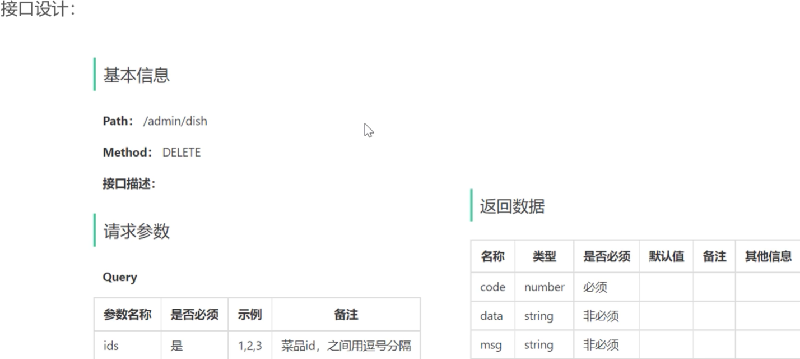

收到！你现在看的是 **Day03-05-新增菜品_需求分析和设计**。

以下是视频里屏幕上展示的“新增菜品”分析设计**的完整文字版内容，包含**业务规则、**接口设计（请求参数与返回结果）**以及**数据库设计**，方便你直接复制和对照：

---

## 1. 业务规则

* **菜品名称必须是唯一的**
* **菜品必须属于某个分类下，不能单独存在**
* **新增菜品时可以根据情况选择菜品的口味属性**
* **每个菜品必须对应一张图片**

---

## 2. 接口设计

### 2.1 根据类型查询分类（已实现）

* 由于新增菜品时必须选择所属分类，所以前端页面一打开，就会发送一个异步请求，查询出所有**菜品分类**（`type = 1`），并在下拉列表中回显。
* **请求路径：** `/admin/category/list`
* **请求方式：** `GET`
* **请求参数：** `type=1`

### 2.2 文件上传（重要前置接口）

* 新增菜品必须上传图片。前端点击上传图片时，会触发该接口，后端将图片存入 OSS（或本地）后，**必须返回图片的可访问 URL 地址**。
* **请求路径：** `/admin/common/upload`
* **请求方式：** `POST`
* **请求参数：** `MultipartFile file`（表单提交）
* **返回数据：** `Result<String>` （`data` 为图片的 URL 地址）

### 2.3 新增菜品（核心接口）

* **请求路径：** `/admin/dish`
* **请求方式：** `POST`
* **请求参数：** JSON 格式（对应后端 `DishDTO`）

#### 📥 请求参数（DishDTO 属性明细）：

```json
{
  "name": "下饭酸菜鱼",      // 菜品名称 (String)
  "categoryId": 10,        // 分类ID (Long)
  "price": 38.00,          // 菜品价格 (BigDecimal)
  "image": "http://...",   // 菜品图片路径 (String)
  "description": "酸辣爽口", // 描述信息 (String)
  "status": 1,             // 状态: 0 停售, 1 起售 (Integer)
  "flavors": [             // 菜品口味关系列表 (List)
    {
      "name": "辣度",
      "value": "[\"微辣\",\"中辣\",\"特辣\"]"
    },
    {
      "name": "忌口",
      "value": "[\"不要葱\",\"不要蒜\"]"
    }
  ]
}

```

* **返回数据：** `Result`（成功或失败提示，无需携带 data）

---

## 3. 数据库设计（涉及两张表）

新增菜品是一个**多表操作**。前端只发送了一次页面提交，但后端需要同时向以下两张表插入数据：

### 3.1 菜品表 (`dish`) — 主表

一条基本信息对应表里的一行数据：

* `id` (主键)
* `name` (菜品名称)
* `category_id` (分类ID)
* `price` (价格)
* `image` (图片地址)
* `description` (描述)
* `status` (状态)
* `create_time` / `update_time` / `create_user` / `update_user` (公共字段，已用 AOP 自动填充)

### 3.2 菜品口味表 (`dish_flavor`) — 从表（一对多）

一个菜品可以有多个口味（如既有“辣度”又有“冰量”），所以需要多条数据记录：

* `id` (主键)
* `dish_id` (**核心外键**：关联 `dish` 表的 `id`)
* `name` (口味名称，如：辣度)
* `value` (口味列表，如：`["微辣","中辣"]`)

---

### 💡 后端开发避坑提示（老师接下来的思路）：

1. **统一 DTO 接收数据**：Controller 层需要用 `@RequestBody DishDTO dishDTO` 来接收前端的 JSON 数据。
2. **主键回显（核心扣分点）**：在往 `dish` 表插入菜品后，必须通过 MyBatis 的 `useGeneratedKeys="true" keyProperty="id"` **拿到刚刚生成的菜品 ID**。因为紧接着往 `dish_flavor` 表插入具体口味时，每一条记录都需要绑定这个 `dish_id`！




# 数据库设计
